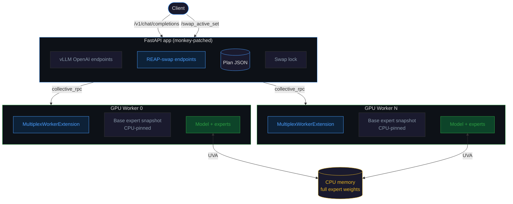

# REAP-swap

Use REAP observation data to make smarter CPU offloading decisions for MoE models in vLLM.

## The problem

Large MoE models (100B+ parameters) don't fit in consumer GPU VRAM. vLLM's UVA backend offloads expert parameters to CPU memory and pulls them in on demand, but it picks which experts to keep GPU-resident by default ordering (typically the tail layers of the model). This works, but it's leaving performance on the table -- the default resident set has no relationship to which experts your workload actually needs.

## The idea

REAP (arXiv:2510.13999) was designed to prune MoE experts permanently. Its observation phase captures per-expert activation mass from calibration prompts -- basically a heatmap of which experts the model routes to most for your workload.

REAP-swap repurposes that heatmap. Instead of pruning, it tells vLLM which experts to pre-load into GPU memory. No experts are removed. The full model remains accessible through UVA. You just get fewer expensive CPU-to-GPU transfers during inference because the hot experts are already resident.


## Results

Tested on Qwen3.5-35B-A3B, 8x RTX 3090, 512GB DDR4, EPYC 7443P (~$10K hardware).

**Speed** (stock UVA vs REAP-swap, same 16-layer resident budget):

| Metric | Stock UVA | REAP-swap | Change |
|--------|-----------|-----------|--------|
| TTFT | 2.85s | 1.59s | **-44%** |
| Prefill | 116.29 tok/s | 133.18 tok/s | **+14.5%** |
| Generation | 14.13 tok/s | 13.94 tok/s | -1.3% |

**Layer allocation** (40 MoE layers, 16 resident budget):

```
Layer    0  1  2  3  4  5  6  7  8  9 10 11 12 13 14 15 16 17 18 19 20 21 22 23 24 25 26 27 28 29 30 31 32 33 34 35 36 37 38 39
Stock    ·  ·  ·  ·  ·  ·  ·  ·  ·  ·  ·  ·  ·  ·  ·  ·  ·  ·  ·  ·  ·  ·  ·  ·  ■  ■  ■  ■  ■  ■  ■  ■  ■  ■  ■  ■  ■  ■  ■  ■
REAP     ·  ■  ■  ■  ■  ■  ■  ·  ·  ·  ·  ·  ·  ·  ·  ·  ·  ·  ·  ·  ·  ·  ·  ·  ■  ■  ■  ■  ■  ■  ■  ■  ·  ·  ·  ·  ·  ·  ■  ■

■ = GPU-resident    · = CPU-offloaded (UVA)
```

Stock picks the tail 16 layers. REAP-swap picks early layers (1-6, high activation mass for coding) plus the stable tail (24-31, 38-39). Same budget, different distribution.

**Quality** (dynamic active-set swaps, 30% resident budget):

88% overall accuracy, 100% coherence across ARC Challenge, GSM8K, HellaSwag, MMLU, WinoGrande. Zero router misses. Zero bytes copied at swap time. See `example/arm2_dynamic_results.md` for full breakdown.

This is slower than full-VRAM serving. The claim is not free performance -- it's better performance than naive offloading when the model doesn't fit in memory.

## What's in this repo and what isn't

This repo contains the **runtime server** and enough context to understand and evaluate the research. It does NOT contain every piece of the pipeline. Here's what's here, what's not, and where to find what's missing.

**Included:**
- The multiplex server that monkey-patches vLLM and adds REAP-swap endpoints
- Three supporting modules (delta computation, plan validation, cartridge cache)
- A complete plan file for Qwen3.5-35B-A3B at 30% resident budget
- Benchmark results from the quality evaluation
- Full research writeup with hypothesis, experiment design, failed paths, and results
- Plan file format specification

**Not included:**
- **REAP observation tool** -- the code that runs the observation phase over calibration data. This comes from the REAP paper (arXiv:2510.13999). You need their codebase to generate observation data.
- **Planner script** -- the code that reads REAP observations and produces the plan JSON. The included plan file (`example/strict30-v2-plan.json`) is a complete working example; the `scorerArtifacts` section inside it contains every parameter needed to re-derive it from the same observations.
- **vLLM UVA patches** -- the multiplex server requires a patched vLLM with selective UVA registry support (details below).
- **Calibration dataset** -- the 2,048 samples used for this research are personal and not redistributable. The extraction toolkit and process are documented below so you can build your own corpus from your own AI coding sessions.
- **Benchmark harness** -- the "three-arm" evaluation framework that produced the quality numbers. Results are included; the test runner is not.
- **Active-set client** -- the server receives active-set payloads via HTTP, but the client-side code that selects slices per request is not included. A curl example is provided below.

## Prerequisites

### Hardware

The benchmarks were run on:
- 8x NVIDIA RTX 3090 (24GB VRAM each, 192GB total)
- AMD EPYC 7443P
- 512GB DDR4 RAM
- ROMED8-2T motherboard
- PCIe Gen 4

The key constraint is having enough system RAM for the full model weights plus enough VRAM for the resident expert budget. The specific GPU count and model depend on what you're serving.

### Software

| Dependency | Version | Notes |
|------------|---------|-------|
| Python | 3.12 | Tested on 3.12; other 3.10+ versions likely work |
| vLLM | 0.17.1 | **Must be patched** -- see below |
| PyTorch | 2.x | Whatever vLLM 0.17.1 pulls in |
| uvloop | any | Used as the async event loop; installed via `pip install uvloop` |
| CUDA | 12.x | Required for `torch.cuda.synchronize()` and `.pin_memory()` |

### vLLM patches required

Stock vLLM 0.17.1 does not support selecting which experts are GPU-resident at runtime. The following changes were made to `vllm/model_executor/offloader/uva.py`:

1. **Selective registry restore/bind helpers** -- functions to restore and bind specific expert weight prefixes to GPU at runtime, rather than the default linear fill.
2. **`reap_set_resident_prefixes(...)`** -- accepts a list of parameter name prefixes and ensures those (and only those) experts are GPU-resident.
3. **Exchange-budget-aware offload logic** -- offload-first/onload-second ordering to avoid exceeding VRAM during expert swaps.
4. **Startup resident prefix support** via `REAP_START_RESIDENT_PREFIXES` env var -- loads a specific set of experts at startup instead of vLLM's default tail-layer allocation.

These patches are not included as diffs. The multiplex server (`vllm_multiplex_server.py`) was designed to work with these modifications -- without them, the server will start but actual GPU tensor swaps will fail. The masks-only mode (`REAP_SWAP_MASKS_ONLY=1`) will still work since it skips GPU memory operations entirely.

## Pipeline overview

The full pipeline has three stages. This repo covers stage 3.

### Stage 0: Build a calibration corpus

The whole point of REAP-swap is workload-specific expert placement. You need a calibration corpus that represents your actual usage patterns. A different corpus produces a different plan with different resident experts. The results in this repo are for a coding-heavy personal workload.

This research used [ai-data-extraction](https://github.com/0xSero/ai-data-extraction) to build the corpus. It's a toolkit (436 stars, no dependencies beyond Python 3.6+) that extracts complete conversation history from 8 AI coding assistants:

| Script | Tool | What it reads |
|--------|------|---------------|
| `extract_claude_code.py` | Claude Code / Claude Desktop | JSONL session files from `~/.claude` |
| `extract_codex.py` | Codex | Rollout JSONL from `~/.codex` |
| `extract_cursor.py` | Cursor (Chat + Composer + Agent) | SQLite databases (`state.vscdb`, `cursorDiskKV`) |
| `extract_opencode.py` | OpenCode (CLI + Desktop) | JSON session files + Tauri .dat files |
| `extract_windsurf.py` | Windsurf | SQLite databases (VSCode-like format) |
| `extract_trae.py` | Trae | JSONL + SQLite |
| `extract_continue.py` | Continue | JSON session files |
| `extract_gemini.py` | Gemini CLI | JSON session files |

Run them:

```bash
git clone https://github.com/0xSero/ai-data-extraction.git
cd ai-data-extraction

# Extract from everything at once
./extract_all.sh

# Or individually
python3 extract_claude_code.py
python3 extract_cursor.py
# etc.
```

Output lands in `extracted_data/` as timestamped JSONL files. Each line is one conversation:

```json
{
  "messages": [
    {
      "role": "user",
      "content": "How do I fix this TypeScript error?",
      "code_context": [
        {"file": "src/index.ts", "code": "const x: string = 123;", "range": {"selectionStartLineNumber": 10}}
      ]
    },
    {
      "role": "assistant",
      "content": "The error occurs because...",
      "suggested_diffs": [...],
      "model": "claude-sonnet-4-5"
    }
  ],
  "source": "cursor-composer",
  "created_at": 1705414222000
}
```

For this research, extraction across all tools produced ~37K records from 19 sources (claude, codex, cursor, factory, opencode, pi, etc.). From that, 2,048 multiturn samples were selected (~187K tokens, 16K-token context window) covering 6 domain tags: code (16,597 records), general (16,113), ops (10,076), research (5,265), writing (2,983), math (2,760). These numbers are preserved in the plan file's `scorerArtifacts.activationCorpus` section.

The JSONL conversations become the input to REAP's observation phase (stage 1). The message content and code context is what drives the model's expert routing patterns during observation.

### Stage 1: Observe (not included)

Run REAP's observation phase over the calibration corpus. This produces per-expert activation mass data -- how much each expert contributes to the model's output across your calibration prompts.

### Stage 2: Plan (not included)

A planner script reads the observation outputs and produces a JSON plan file. The plan specifies:
- **Core experts** per layer (always GPU-resident based on activation mass ranking)
- **Specialist slices** (groups of co-activated experts that can be swapped in per-request)
- **Budget constraints** derived from available VRAM

See `reap_plan.schema.md` for the full plan file format. The included `example/strict30-v2-plan.json` is a working plan for Qwen3.5-35B-A3B with a 30% resident budget (63.4 GiB full BF16 model, ~19 GiB resident).

The plan's `scorerArtifacts` section (starting around line 30,639) contains every parameter used to generate it: selection strategy, rotation policy, layer budget targets, task family priors, feature normalization stats, and activation corpus metadata. Given the same observation data, you can re-derive this plan.

### Stage 3: Serve (this repo)

Start vLLM with the multiplex server. It loads the plan, monkey-patches vLLM's `build_app`, injects worker extensions via dynamic class patching, and adds HTTP endpoints for expert set management.

## Running the server

```bash
# Required
export REAP_PLAN_FILE=/path/to/strict30-v2-plan.json
export REAP_SWAP_MASKS_ONLY=1
export REAP_ENABLE_ROUTER_MASKS=0

# Optional
export REAP_MAX_LOADED_CARTRIDGES=4        # LRU cache size for legacy cartridges
export REAP_SWAP_VALIDATE_ONLY=0           # Set to 1 for dry-run (validate payloads without GPU ops)

# Start the server
# All standard vLLM CLI arguments are supported (--model, --tensor-parallel-size, etc.)
python -m reap_swap.vllm_multiplex_server \
  --model Qwen/Qwen3.5-35B-A3B \
  --cpu-offload-params experts \
  --tensor-parallel-size 8
```

### What happens at startup

1. Module import: saves vLLM's original `build_app`, patches all `MultiplexWorkerExtension` methods onto vLLM's `Worker` / `CPUWorker` / `XPUWorker` classes.
2. `__main__`: calls `vllm.entrypoints.openai.api_server.cli_env_setup()`, parses standard vLLM CLI args, starts the server via `uvloop`.
3. When vLLM calls `build_app`: the patched version loads `REAP_PLAN_FILE`, validates its structure (must have `mode: "dynamic_core_specialist"`, non-empty `budget` and `perLayer`, each layer must have `coreExperts` and `sliceCatalog`), registers REAP endpoints, returns the augmented FastAPI app.
4. On first swap request: lazily creates a CPU-pinned clone of all expert parameters as the base snapshot.

### Environment variables reference

| Variable | Required | Default | Description |
|----------|----------|---------|-------------|
| `REAP_PLAN_FILE` | **Yes** | none | Path to the plan JSON. Server won't start without it. |
| `REAP_SWAP_MASKS_ONLY` | No | `0` | If `1`, active-set swaps skip GPU tensor operations entirely. All experts remain accessible via UVA; swaps only update internal tracking and router masks. **This is the working configuration.** |
| `REAP_ENABLE_ROUTER_MASKS` | No | `1` | If `0`, disables the forward hooks that mask router logits for inactive experts. **Should be `0` for quality parity.** Setting to `1` adds `-inf` masks to gate logits for non-active experts, which destroyed output quality in testing. |
| `REAP_MAX_LOADED_CARTRIDGES` | No | `4` | Maximum cartridge snapshots kept in CPU-pinned memory (LRU eviction). Only relevant for the legacy `/swap_cartridge` path. |
| `REAP_SWAP_VALIDATE_ONLY` | No | `0` | If `1`, `/swap_active_set` validates the payload against the plan but never calls the GPU RPC. Returns a dry-run result. Useful for integration testing. |

### Why `REAP_SWAP_MASKS_ONLY=1` and `REAP_ENABLE_ROUTER_MASKS=0`

Two techniques that seemed obvious both wrecked output quality:

- **Expert zeroing** (zeroing weights of non-resident experts in VRAM): produced garbled output.
- **Router masking** (adding `-inf` to gate logits for non-active experts): also destroyed quality.

The working configuration disables both. All experts stay in the computation graph. The router can still send tokens to any expert. Experts not in VRAM get fetched from CPU via UVA -- slower, but correct. REAP-swap's value is making sure the most likely destinations are already in VRAM.

## API endpoints

The server adds these endpoints on top of vLLM's standard OpenAI-compatible API (`/v1/chat/completions`, `/v1/completions`, `/v1/models`, `/health`, etc.):

### `POST /swap_active_set`

The primary endpoint. Swaps the active expert set for a request.

**Request body:**
```json
{
  "request_id": "req-001",
  "phase": "prefill",
  "active_set": {
    "layer_0": [0, 1, 2, 3, 5, 8],
    "layer_1": [0, 2, 4, 7, 9, 12],
    "layer_2": [1, 3, 5, 6, 8, 11]
  },
  "budget_bytes": 0
}
```

- `request_id`: unique identifier for this request (required)
- `phase`: `"prefill"` or `"decode_refresh"` (required). Decode refreshes are budget-limited by `plan.budget.max_refreshes_per_request`.
- `active_set`: per-layer lists of expert indices to make resident (required). Keys can be `"layer_0"` or just `"0"`. Every expert index must exist in the plan's `coreExperts` or `sliceCatalog` for that layer.
- `budget_bytes`: optional, defaults to 0.

**Response** includes: swap timing, delta summary (experts added/removed/reused per layer), active-set signature (SHA-256 truncated to 16 hex chars), validation details, and forensic payload.

If the requested signature matches the currently active signature, the swap is a no-op (returned immediately).

### `POST /warm_active_set`

Same as `/swap_active_set` but with `warm_start_only=True`. Optionally accepts `"reset_router_stats": true` in the body.

### `GET /router_misses/{request_id}`

Returns per-layer router miss statistics: inactive mass, observed mass, inactive experts. Aggregated across all workers. Add `?reset=true` to reset stats after reading.

### `GET /forensics/{request_id}`

Returns the last swap forensic payload, refresh count, and plan identity for a request.

### `POST /swap_cartridge/{cartridge_id}`

Legacy path. Loads a pre-built cartridge snapshot from CPU-pinned memory, copies full expert tensors to GPU, applies router masks. LRU-managed; first access triggers lazy loading.

## Example: sending an active-set swap

```bash
# Swap to a specific expert set before making an inference request
curl -X POST http://localhost:8000/swap_active_set \
  -H "Content-Type: application/json" \
  -d '{
    "request_id": "my-request-001",
    "phase": "prefill",
    "active_set": {
      "layer_0": [0, 1, 3, 5, 7, 9, 12, 15, 18, 20, 24, 28, 31, 35, 40],
      "layer_1": [0, 2, 4, 6, 8, 11, 14, 17, 19, 22, 25, 29, 33, 37, 42]
    }
  }'

# Then make a normal inference request
curl -X POST http://localhost:8000/v1/chat/completions \
  -H "Content-Type: application/json" \
  -d '{
    "model": "Qwen/Qwen3.5-35B-A3B",
    "messages": [{"role": "user", "content": "Hello"}]
  }'

# Check router misses for the request
curl http://localhost:8000/router_misses/my-request-001
```

The active-set expert indices come from the plan file. Each layer in `plan.perLayer` has `coreExperts` (always-needed experts) and `sliceCatalog` (groups of co-activated experts). A client would typically union the core experts with one or more specialist slices selected based on the prompt.

## How the server works internally



### Monkey-patching

Two things get patched at import time:

1. **`api_server.build_app`** is replaced with `build_app_with_swap`, which calls the original, then attaches REAP state to `app.state` (plan, swap lock, request tracking dicts) and registers the custom endpoints.

2. **vLLM worker classes** (`vllm.v1.worker.gpu_worker.Worker`, `cpu_worker.CPUWorker`, `xpu_worker.XPUWorker`) get all methods from `MultiplexWorkerExtension` injected onto them. This is how the server calls RPC methods like `multiplex_swap_active_set` on workers -- vLLM's `collective_rpc` dispatches to these injected methods.

### Worker extension methods

Key methods injected onto each vLLM worker:

| Method | What it does |
|--------|-------------|
| `_get_base_expert_snapshot` | Lazily clones all expert parameters to CPU-pinned memory (the "clean" reference copy) |
| `_resolve_model_layers` | Finds the transformer layer list in the model (handles both `model.model.layers` and `model.language_model.model.layers`) |
| `_apply_router_masks_and_hooks` | Installs forward hooks on gate modules that track router misses and optionally mask logits |
| `multiplex_swap_active_set` | Delta-based swap: zeros removed experts, copies added experts from base snapshot, updates router masks |
| `multiplex_load_cartridge` | Clones base snapshot, zeros non-keep experts, stores as CPU-pinned cartridge |
| `multiplex_swap_cartridge` | Copies a pre-built cartridge from CPU to GPU |
| `multiplex_get_router_misses` | Returns per-layer router miss stats for a request ID |

### Concurrency

Only one active-set swap can be in flight at a time (`asyncio.Lock`). The mode is always `serialized_single_flight`. This is deliberate -- concurrent GPU tensor operations during swaps would corrupt state.

### Model assumptions

The server assumes:
- The model is a Mixture-of-Experts architecture with transformer layers
- Each layer has `layer.mlp.gate` (the router) and `layer.mlp.experts`
- Expert parameters are indexed along dimension 0: `param.data[expert_idx]` selects one expert
- If `layer.mlp.experts` has an `_expert_map` attribute, it maps global expert indices to local (packed) indices
- The gate's `weight.shape[0]` equals the number of experts

## File layout

```
README.md                            -- this file
research.md                          -- full research writeup: hypothesis, experiment design,
                                        failed paths, results
reap_plan.schema.md                  -- plan file format specification with all fields documented

reap_swap/
  __init__.py
  vllm_multiplex_server.py           -- the runtime server (1111 lines)
  dynamic_swap_delta.py              -- builds dense keep-sets, computes per-layer deltas
                                        between current and desired expert sets
  dynamic_reap.py                    -- plan SHA-256 hashing, active-set payload validation,
                                        router miss summarization
  multiplex_cache.py                 -- LRU eviction for legacy cartridge cache

example/
  strict30-v2-plan.json              -- 30% budget plan for Qwen3.5-35B-A3B (~40K lines)
  arm2_dynamic_results.md            -- benchmark results from quality evaluation
```

## Related

- [REAP paper](https://arxiv.org/abs/2510.13999) -- the pruning method whose observation phase this builds on
- [Full research writeup](research.md) -- experiment history, failed paths, and detailed analysis
- [ai-data-extraction](https://github.com/0xSero/ai-data-extraction) -- the tool used to build the calibration corpus
- [Kimi-K2.5-PRISM-REAP-530B-A32B](https://huggingface.co/Ex0bit/Kimi-K2.5-PRISM-REAP-530B-A32B) -- 50% REAP-pruned Kimi-K2.5, the second model tested in this research
