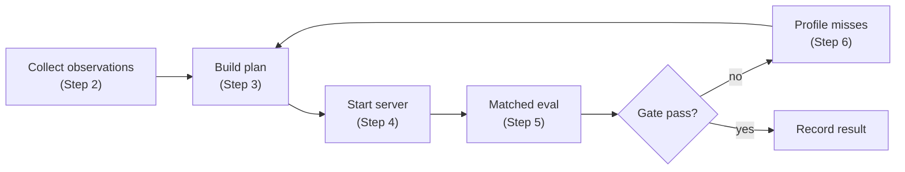

# reap-expert-swap

Reduce the VRAM footprint of sparse MoE models by keeping a profiled expert floor resident and dynamically swapping in prompt-conditioned specialists at request time.

This is experimental research code. The system works end to end but has not reached BF16 parity. Best live result: **86% parsed-answer agreement** against the BF16 baseline on a matched 50-prompt evaluation. Current testbed: **Qwen3.5-35B-A3B** (63.4 GiB full BF16).

For the full narrative of what was tried, what failed, and why, read [the blog post](docs/notes/blog.md).

---

## How to reproduce from scratch

This is a step-by-step guide to running the full pipeline. Steps 0-1 need no GPU. Steps 2-6 need a GPU machine.

### Choose hardware and model

You need a GPU machine that can hold the full BF16 weights (for the baseline) or at minimum the resident floor (for the dynamic server). Run them sequentially on one machine or in parallel on two.

| Provider | Recommended config | Cost | Notes |
|---|---|---|---|
| Own hardware | 8x RTX 3090 (192 GiB total) | ~$8k one-time | What this was built on. TP8. |
| [Vast.ai](https://vast.ai) | 1x A100 80GB | ~$0.80-2/hr | Cheapest cloud path. |
| [RunPod](https://runpod.io) | 1x A100 80GB | ~$1-3/hr | Use their vLLM template. |
| [Lambda](https://lambdalabs.com) | 1x A100 80GB | ~$1.10/hr | On-demand. |

This repo was built against [Qwen/Qwen3.5-35B-A3B](https://huggingface.co/Qwen/Qwen3.5-35B-A3B) (35B params, 3B active, 40 MoE layers, 256 experts/layer). Any vLLM-compatible sparse MoE model with standard gate+experts routing should work, but only Qwen3.5-35B-A3B has been tested end to end.

### Step 0: Install

```bash
git clone https://github.com/0xsero/reap-expert-swap.git
cd reap-expert-swap
uv sync            # core deps only, no GPU needed
uv sync --extra gpu   # adds torch + vllm (do this on the GPU machine)
```

Requires Python 3.11+ and [uv](https://docs.astral.sh/uv/).

### Step 1: Run the tests (no GPU)

```bash
uv run python -m pytest tests_py/ -v
```

45 tests should pass. These validate plan building, budget math, gate logic, router activity, and the support router without touching a GPU.

### Step 2: Collect observation data (GPU required)

This is the step most READMEs skip. You need **observation summaries**: JSON files that record per-layer expert activation frequencies for your model on a calibration corpus. These tell the plan builder which experts matter.

There are two ways to get observation data:

**Option A: Use Cerebras REAP directly.** Install the [REAP library](https://github.com/cerebras/REAP) and run its observer on your model with a calibration dataset. This produces per-layer expert frequency and REAP saliency scores. The observation summary JSON needs this shape:

```json
{
  "model": "Qwen/Qwen3.5-35B-A3B",
  "workflow": "my_calibration",
  "processedSamples": 500,
  "totalTokens": 50000,
  "layers": {
    "0": {
      "reap": [0.9, 0.8, 0.7, ...],
      "expert_frequency": [90, 80, 70, ...]
    },
    "1": { ... }
  }
}
```

Each layer has a `reap` array (saliency scores, one per expert) and an `expert_frequency` array (activation counts, one per expert). The plan builder reads these to decide which experts go in the floor.

**Option B: Bootstrap from the evaluator's router activity data.** If you already have the patched vLLM server running (Step 3) with any initial plan (even a naive one), the evaluator records per-request router activity during evaluation. You can then profile that activity:

```bash
# Run an eval with any initial plan (even a bad one)
uv run python scripts/evaluate_original_vs_multiplex.py \
  --dynamic-url http://localhost:8011/v1 \
  --plan initial-plan.json \
  --sample-count 50 --seed 7 \
  --output-dir results/bootstrap/

# Profile the router activity from that run
uv run python scripts/profile_router_activity.py \
  --dynamic-payload results/bootstrap/dynamic.json \
  --plan initial-plan.json \
  --output results/bootstrap/router-profile.json
```

The router profile records which experts the router wanted per layer, which were active vs inactive, and the mass distribution. Feed this into the floor builder to produce a better plan.

**Calibration dataset matters.** From the static compression work: 1,360 high-quality domain-relevant samples beat 10,000 generic ones. Your calibration corpus should activate all experts, highlight what you want to retain, and use dense context.

### Step 3: Build a plan (no GPU needed after observation)

Build a dynamic plan from observation summaries:

```bash
uv run python scripts/build_partitioned_reap_plan.py \
  --mode dynamic \
  --observation-summary observer-summary.json \
  --signal-key reap \
  --max-resident-ratio 0.37 \
  --output-json plan.json \
  --output-md plan.md
```

Or refine an existing plan into a profiled floor using router activity profiles from Step 2B:

```bash
uv run python scripts/build_profiled_floor_plan.py \
  --base-plan plan.json \
  --profile router-profile.json \
  --active-threshold full95 \
  --inactive-threshold full80 \
  --output floor-plan.json
```

The plan is a JSON document. Per MoE layer it specifies **coreExperts** (always resident), a **sliceCatalog** (swappable specialist groups), and a **budget** (VRAM constraints).

### Step 4: Start the patched vLLM server (GPU required)

```bash
REAP_PLAN_FILE=plan.json \
REAP_ENABLE_ROUTER_MASKS=1 \
uv run python scripts/vllm_multiplex_server.py \
  --model /path/to/Qwen3.5-35B-A3B \
  --tensor-parallel-size 8 \
  --port 8011
```

This monkey-patches vLLM at import time to add `/swap_active_set`, `/swap_cartridge/{id}`, and `/router_misses/{id}` endpoints. It validates the plan on startup. Adjust `--tensor-parallel-size` to match your GPU count.

For the baseline, run stock vLLM on a different port (or run sequentially on the same port):

```bash
uv run python -m vllm.entrypoints.openai.api_server \
  --model /path/to/Qwen3.5-35B-A3B \
  --tensor-parallel-size 8 \
  --port 8090
```

### Step 5: Run matched evaluation (GPU required)

```bash
uv run python scripts/evaluate_original_vs_multiplex.py \
  --baseline-url http://localhost:8090/v1 \
  --dynamic-url http://localhost:8011/v1 \
  --plan plan.json \
  --sample-count 50 --seed 7 \
  --output-dir results/my-experiment/
```

Produces `baseline.json`, `dynamic.json`, `gate.json`. Everything runs at temperature 0, same prompts, same seed. The gate automatically checks accuracy, coherence, parse error, and swap latency against thresholds.

### Step 6: Profile, improve, repeat

```bash
uv run python scripts/profile_router_activity.py \
  --dynamic-payload results/my-experiment/dynamic.json \
  --plan plan.json \
  --output results/my-experiment/router-profile.json
```

The profile tells you where the floor is missing important experts. Feed it back into the floor builder (Step 3) and iterate.



---

## What is in this repo

16 scripts with the core research logic, 45 regression tests, architecture docs, and the full research history.

| Script | What it does |
|---|---|
| `dynamic_reap.py` | Plan generation and request-time active-set construction |
| `evaluate_original_vs_multiplex.py` | Matched BF16-vs-dynamic evaluator |
| `vllm_multiplex_server.py` | Patched vLLM runtime with delta swaps and router masks |
| `research_gate.py` | Automatic pass/fail gating |
| `profile_router_activity.py` | Post-hoc router activity profiling |
| `build_profiled_floor_plan.py` | Profile-derived floor construction |
| `build_partitioned_reap_plan.py` | Plan building from observation data |
| `train_support_router.py` | Learned support-router training (`uv sync --extra train`) |
| `size_estimator.py` | VRAM and BF16 size estimation |

Full list in [scripts/](scripts/).

### What is NOT in this repo

The private repo has ~46 scripts. The 30 excluded ones are not portable -- they contain hardcoded SSH credentials, private IPs, remote PID management, and homelab-specific wiring. The autoresearch loop itself is just the included scripts wired together: generate plan, deploy, evaluate, gate, profile, repeat. The excluded scripts only automate the SSH/restart plumbing for one specific 8x3090 machine.

---

## Current results

### Best live matched result

50-prompt seed-7 evaluation with disagreement-conditioned hybrid reranking:

| Metric | Value |
|---|---:|
| Full BF16 model size | 63.4 GiB |
| Resident floor | 23.49 GiB (37% of full) |
| Accuracy | 80.0% |
| BF16 answer agreement | 86.0% |
| BF16 response similarity | 88.56% |
| Avg swap time | 0.669s |

### What works

- **Routing is concentrated**: 7.6% of experts carry 50% of routing mass
- **Delta swaps**: 1.875 GiB / 0.151s transitions between active sets
- **Profiled floors beat heuristics**: 74% holdout accuracy at 23.5 GiB vs 38% from blind selection
- **Disagreement reranking**: pushed answer agreement from 78% to 86%

### What does not work

- **20% resident budget**: 22 experiments, all rejected, best was 38% retained accuracy
- **Blind heuristic selectors**: pick nearly the same experts for every prompt
- **Packaging hacks**: benchmark-pure grouping hit 2% accuracy
- **BF16 parity**: not reached at any budget

The full experiment ledger with all 22 attempts is in [docs/research_history_20260312.md](docs/research_history_20260312.md).

---

## Docs

- [Blog post](docs/notes/blog.md) -- full narrative of the project
- [System Technical Report](docs/system_technical_report_20260312.md) -- architecture, runtime, evaluator
- [Research History](docs/research_history_20260312.md) -- all experiments chronologically
- [Research Protocol](docs/protocol/research_protocol.md) -- evaluation methodology
- [Core Architecture](docs/architecture/core_specialist_dynamic_architecture.md) -- core/specialist design
- [Multiplex Loading](docs/architecture/multiplex_loading_strategy.md) -- swapping and eviction
- [RESEARCH.md](RESEARCH.md) -- summary

## License

Apache License 2.0. See [LICENSE](LICENSE).
