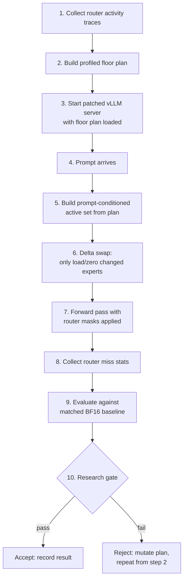
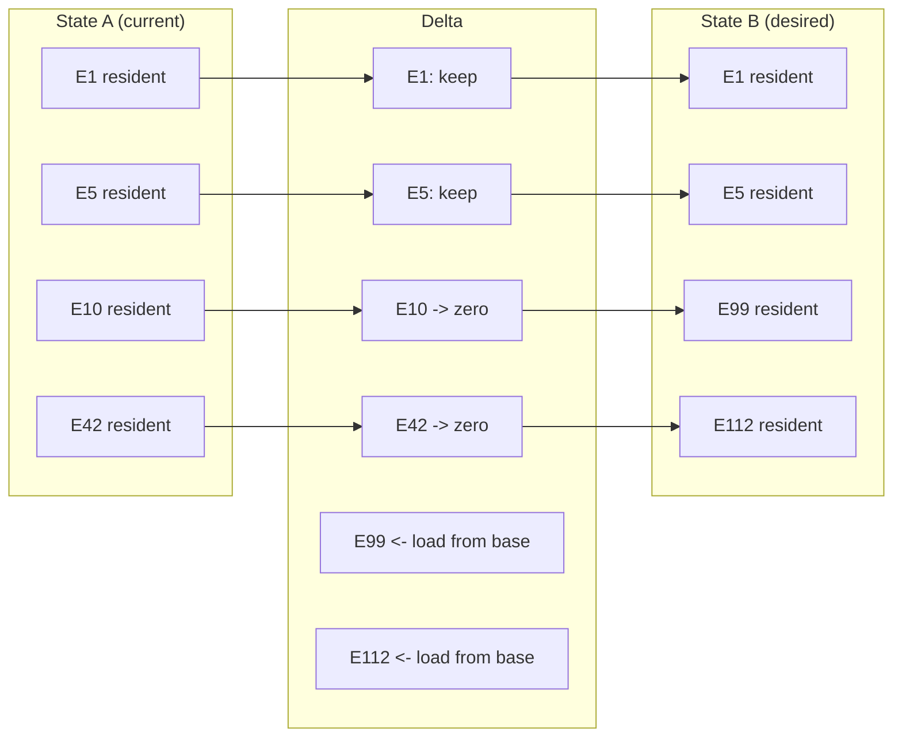
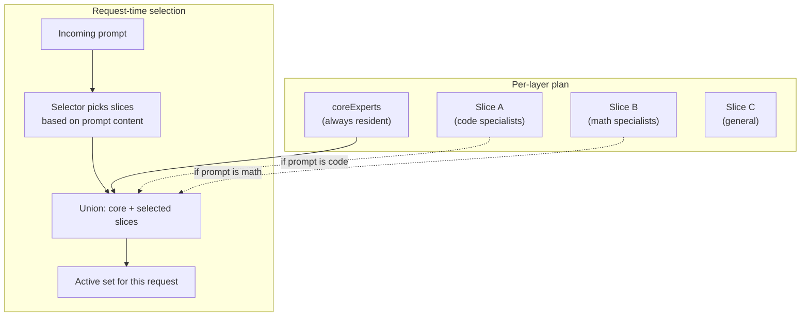
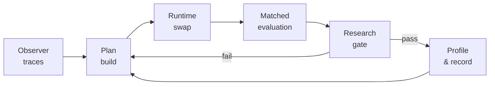
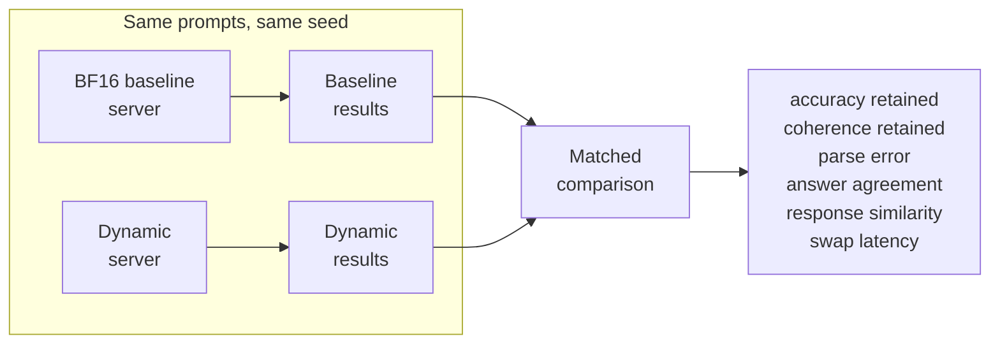
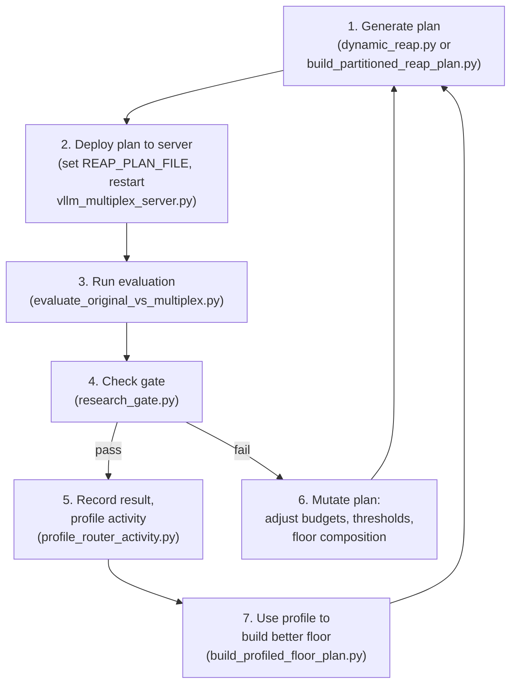

# reap-expert-swap

Dynamic expert-floor construction and runtime swapping for sparse Mixture-of-Experts models.

This repo is a research system for reducing the **resident VRAM footprint** of large MoE models while trying to preserve the behavior of the dense **BF16 baseline**.

The current testbed is **Qwen3.5-35B-A3B**. The core idea is:

1. keep a **profiled floor** of experts resident in GPU memory
2. build a **prompt-conditioned specialist tail** at request time
3. apply **delta swaps** instead of rebuilding the full expert state
4. compare every candidate against a **matched BF16 baseline**

This is **experimental research code**, not a polished package.

## Current status

The system works end to end, but it has **not** reached BF16 parity yet.

### Best current live matched result

This is the most trustworthy current live number set from the repo's matched 50-prompt seed-7 evaluation slice:

| Metric | Value | Notes |
| --- | ---: | --- |
| Full BF16 model size | 63.4 GiB | estimated via `scripts/size_estimator.py` |
| Resident floor size | 23.49 GiB | profiled floor / hybrid rerank target |
| Raw accuracy | 80.0% | matched 50-prompt slice |
| Coherence | 100.0% | matched 50-prompt slice |
| Parse error | 0.0% | matched 50-prompt slice |
| BF16 parsed-answer agreement | 86.0% | primary fidelity metric |
| BF16 response similarity | 88.56% | normalized text similarity |
| Exact response match | 68.0% | normalized exact string match |
| Avg swap time | 0.669s | live dynamic run |

Artifacts:
- `test-output/disagreement-router-v0/live-smoke-seed7-s10/dynamic.json`
- `test-output/disagreement-router-v0/live-smoke-seed7-s10/live-rerank-comparison.md`

### Important caveats

- Earlier **98% retained accuracy** numbers were **in-sample** and should not be treated as the public headline.
- The strongest trustworthy comparisons in this repo are the **matched BF16 baseline** runs and the **holdout/profiled-floor** runs.
- Current results are still based on **small evaluation slices** (typically 5-50 prompts), not a large benchmark campaign.

## How the system works



### Delta swap mechanics

The system does not rebuild the full expert state on every request. It computes a diff between the current loaded experts and the desired active set, then only touches the delta:



| Swap type | Data touched | Time |
|---|---:|---:|
| Dense to sparse (first load) | 51.80 GiB | 10.11s |
| Sparse A to sparse B (delta) | 1.875 GiB | 0.151s |
| Same set repeated (no-op) | 0 GiB | 0.000s |

### Router masking

After each swap, the system installs forward hooks on every MoE gate layer. These hooks:
1. Record which experts the router wanted to activate (for miss tracking)
2. Apply `-inf` masks to gate logits for non-resident experts, forcing the router to only select from the loaded active set

This means the model never tries to route to a zeroed expert during inference.

### Plan structure

A plan is a JSON document that describes, per MoE layer:
- **coreExperts**: always-resident experts (the floor)
- **sliceCatalog**: groups of specialist experts that can be swapped in
- **budget**: VRAM budget constraints



## What this repo contains

This repo contains the core building blocks for the experiment loop:

- **plan building** for dynamic expert floors and specialist tails
- a **patched vLLM runtime** for expert active-set swaps
- a **matched evaluator** for baseline-vs-dynamic comparisons
- a **research gate** for automatic acceptance/rejection
- **router activity profiling** and profile-derived floor construction
- a lightweight **learned support-router** path

### What is NOT included (and why)

The private research repo has ~46 scripts. This public repo ships 16 of them. The excluded scripts fall into these categories:

| Category | Examples | Why excluded |
|---|---|---|
| **Remote orchestration** | `run_autoresearch_dynamic_smoke.py`, `run_autoresearch_daemon.py`, `run_continuous_research.py` | Hardcoded SSH user/host (`ser@192.168.1.70`), remote paths, PID management, port killing logic. Not portable. |
| **Infrastructure wiring** | `remote_collect_workflow_observations.py`, `target_controller.py`, `run_experiment_batch.py` | Tightly coupled to the specific 8x3090 homelab setup. |
| **Internal utilities** | `update_experiment_ledger.py`, `fix_ledger_gate_paths.py`, `build_public_release_tree.py` | Repo maintenance scripts, not research logic. |
| **Experimental dead ends** | `run_packaging_sweep.py`, `run_composition_packaging_sweep.py` | Packaging approaches that were tried and failed. The logic is documented in the experiment ledger. |
| **Dashboard/visualization** | `build_research_dashboard.py`, `build_experiment_visual_dashboard.py` | Depend on the full private artifact tree. |

The included 16 scripts are the ones that contain the actual research logic: plan building, evaluation, runtime patching, gating, profiling, and the learned router.

## Core flow

The research loop looks like this:



More concretely:

1. collect or load router activity / observation summaries
2. build a dynamic or profile-derived plan
3. start the patched runtime
4. run matched evaluation against the BF16 baseline
5. gate the result on accuracy, coherence, parse error, and latency
6. profile the outcome and use it to build the next plan

## What is proven vs not proven

### Proven

- **delta swaps work** -- fractional-GiB transitions between active sets in sub-second time
- **dynamic active-set serving works** -- the patched vLLM runtime correctly applies router masks and tracks misses per request
- **profile-derived floors beat blind heuristic floors** -- profiled floor at 23.49 GiB outperforms naive frequency-based floors
- **disagreement-conditioned reranking improves live numbers** -- hybrid rerank pushed answer agreement from 78% to 86%

### Not proven

- BF16 parity (best is 86% answer agreement, not 100%)
- benchmark-safe parity across all 5 benchmark families
- robust generalization across large holdout sets
- ultra-low resident targets like the original 20% dream (all 22 attempts at 12.68 GiB rejected)

## How to reproduce

### Prerequisites

- Python 3.11+
- [uv](https://docs.astral.sh/uv/) for dependency management
- For GPU work: a multi-GPU machine with 24+ GiB total VRAM, vLLM 0.16+, PyTorch 2.x with CUDA, and a copy of [Qwen3.5-35B-A3B](https://huggingface.co/Qwen/Qwen3.5-35B-A3B) weights

### Step 0: Clone and install

```bash
git clone https://github.com/0xsero/reap-expert-swap.git
cd reap-expert-swap
uv sync
```

### Step 1: Run the non-GPU regression tests

This validates that the core logic works without any GPU or model weights:

```bash
uv run python -m pytest tests_py/ -v
```

You should see 45 tests pass. These cover plan building, budget computation, active-set validation, gate logic, multi-turn evaluation, router activity aggregation, and the support router.

### Step 2: Build a plan (no GPU needed)

Plans are built from observation summaries -- JSON files that describe per-layer expert activation frequencies from prior runs.

If you have observation summaries:

```bash
uv run python scripts/build_partitioned_reap_plan.py \
  --mode dynamic \
  --observation-summary path/to/observer-summary.json \
  --signal-key reap \
  --max-resident-ratio 0.37 \
  --output-json my-plan.json \
  --output-md my-plan.md
```

If you have a base plan and a router activity profile, refine it into a profiled floor:

```bash
uv run python scripts/build_profiled_floor_plan.py \
  --base-plan path/to/base-plan.json \
  --profile path/to/router-activity-profile.json \
  --active-threshold full95 \
  --inactive-threshold full80 \
  --output path/to/floor-plan.json
```

### Step 3: Start the patched vLLM server (GPU required)

```bash
REAP_PLAN_FILE=path/to/plan.json \
REAP_MAX_LOADED_CARTRIDGES=4 \
REAP_ENABLE_ROUTER_MASKS=1 \
uv run python scripts/vllm_multiplex_server.py \
  --model /path/to/Qwen3.5-35B-A3B \
  --tensor-parallel-size 8 \
  --port 8011
```

The server:
- Monkey-patches vLLM worker classes to add `multiplex_swap_active_set`, `multiplex_load_cartridge`, and router miss tracking
- Validates the plan JSON on startup (must be `dynamic_core_specialist` mode with `perLayer` and `budget`)
- Exposes `/swap_active_set`, `/swap_cartridge/{id}`, `/router_misses/{id}` HTTP endpoints
- Applies router masks after each swap to prevent routing to zeroed experts

### Step 4: Run a matched evaluation (GPU required)

With the BF16 baseline server on one port and the dynamic server on another:

```bash
uv run python scripts/evaluate_original_vs_multiplex.py \
  --baseline-url http://localhost:8090/v1 \
  --dynamic-url http://localhost:8011/v1 \
  --plan path/to/plan.json \
  --sample-count 50 \
  --seed 7 \
  --output-dir results/my-experiment/
```

This produces:
- `baseline.json` -- per-sample baseline results
- `dynamic.json` -- per-sample dynamic results with swap times and router misses
- `gate.json` -- automatic pass/fail verdict
- Per-benchmark accuracy, coherence, parse error, similarity, and answer agreement

### Step 5: Check the gate

The evaluator runs the gate automatically, but you can also run it standalone:

```bash
uv run python -c "
import json, pathlib
from research_gate import evaluate_payload_gate
payload = json.loads(pathlib.Path('results/my-experiment/dynamic.json').read_text())
verdict = evaluate_payload_gate(payload, gate_profile='parity_singleturn')
print(json.dumps(verdict, indent=2))
" 
```

Gate thresholds for the `parity_singleturn` profile:
- accuracy retained >= 95%
- coherence retained >= 92%
- quality loss <= 5%
- parse error rate <= 4%
- avg swap time <= 2.5s

### Step 6: Profile and iterate

After a run, profile the router activity to find where the floor is missing important experts:

```bash
uv run python scripts/profile_router_activity.py \
  --dynamic-payload results/my-experiment/dynamic.json \
  --plan path/to/plan.json \
  --output results/my-experiment/router-profile.json
```

The profile shows per-layer inactive mass, which experts the router wanted but were not resident, and coverage statistics. Use this to build a better floor plan and repeat from Step 2.

## Key scripts

| Script | Purpose |
| --- | --- |
| `scripts/dynamic_reap.py` | plan generation and request-time active-set construction |
| `scripts/evaluate_original_vs_multiplex.py` | matched BF16-vs-dynamic evaluator |
| `scripts/vllm_multiplex_server.py` | patched vLLM runtime with active-set swapping |
| `scripts/research_gate.py` | automatic pass/fail gate |
| `scripts/profile_router_activity.py` | post-hoc router activity profiling |
| `scripts/build_profiled_floor_plan.py` | build profile-derived floors |
| `scripts/build_partitioned_reap_plan.py` | build partitioned plans from observation data |
| `scripts/support_router.py` | learned support-router utilities |
| `scripts/build_support_router_dataset.py` | support-router dataset construction |
| `scripts/train_support_router.py` | lightweight support-router training (requires scikit-learn) |
| `scripts/dynamic_swap_delta.py` | delta-swap computation |
| `scripts/multiplex_cache.py` | LRU cartridge cache management |
| `scripts/router_activity.py` | router activity aggregation and coverage utilities |
| `scripts/size_estimator.py` | VRAM / BF16 size estimation |
| `scripts/personal_activation_corpus.py` | activation corpus builder from chat history |
| `scripts/run_budget_oracle_analysis.py` | budget oracle analysis from trace data |

## Evaluation method

All serious comparisons in this repo should be read through the same lens:

- run the **BF16 baseline** and the **dynamic candidate** on the **same prompts**
- same **seed**, same **temperature** (0)
- compare:
  - benchmark accuracy
  - coherence
  - parse error
  - parsed-answer agreement vs BF16
  - response similarity vs BF16
  - swap and sample latency



The benchmark suite:

| Benchmark | Type | Samples per eval |
|---|---|---:|
| MMLU | MCQ (A-E) | 10 |
| ARC Challenge | MCQ (A-E) | 10 |
| HellaSwag | MCQ (A-E) | 10 |
| WinoGrande | binary (1/2) | 10 |
| GSM8K | math (free-form) | 10 |

## About autoresearch

This project uses an autoresearch pattern inspired by [karpathy/autoresearch](https://github.com/karpathy/autoresearch): an autonomous loop that generates candidate plans, materializes them on a GPU machine, runs baseline-vs-dynamic evaluation, checks the result against a gate, and mutates toward the next experiment.

The autoresearch orchestration scripts are **not included** because they contain hardcoded SSH credentials, private IP addresses, remote PID management, and homelab-specific port killing logic that is not portable. The scripts that ARE included are the building blocks the loop calls.

To build your own autoresearch loop, wire the included scripts together:



Over 22 experiments were run through this loop at the 20% resident budget (12.68 GiB). All 22 were rejected by the gate. The best 20%-regime result was 38% retained accuracy. That led to relaxing the budget to 37% (23.49 GiB) with a profiled floor, which achieved the current best numbers.

## Main docs

- `RESEARCH.md` -- curated research summary
- `docs/system_technical_report_20260312.md` -- architecture, runtime, evaluator, and findings
- `docs/protocol/research_protocol.md` -- evaluation protocol and scientific controls
- `docs/architecture/core_specialist_dynamic_architecture.md` -- core/specialist design
- `docs/architecture/multiplex_loading_strategy.md` -- runtime loading / swapping / eviction behavior
- `docs/protocol/multi_turn_eval_protocol.md` -- multi-turn evaluation protocol
- `docs/research_history_20260312.md` -- full chronological experiment history
- `docs/notes/blog.md` -- informal writeup of the full project arc

## Repo layout

```
scripts/      core runtime, planning, and evaluation logic (16 scripts)
tests_py/     non-GPU regression tests (45 tests)
docs/         technical docs, protocol docs, research history
configs/      config notes / placeholders
dataset/      dataset notes / placeholders
artifacts/    curated experiment summaries
examples/     example configurations (placeholder)
```

## Current best interpretation

The runtime problem is mostly solved enough to iterate.

The remaining hard problem is **selection quality**:
- which experts must stay in the resident floor
- which specialists must be swapped in for this prompt
- how to make the dynamic answer stay close to the BF16 answer

That is the frontier this repo is working on.

## License

Apache License 2.0. See [LICENSE](LICENSE).
