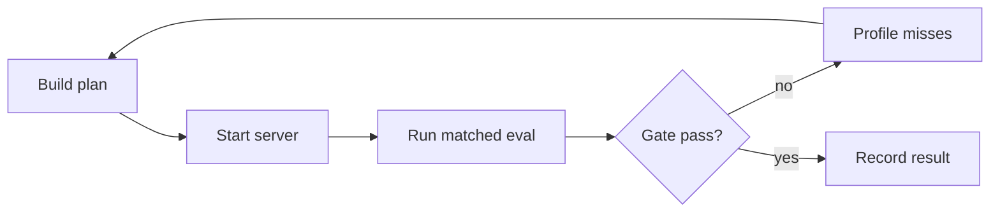
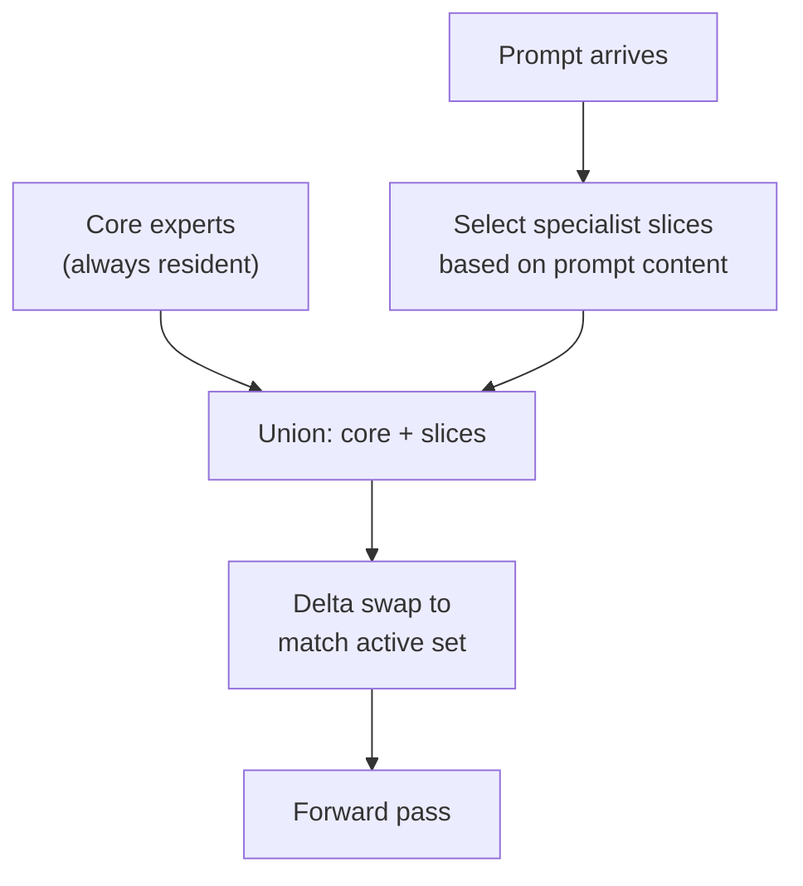

# reap-expert-swap

Dynamic expert-floor construction and runtime swapping for sparse Mixture-of-Experts models. Experimental research code, not a polished package.

The core idea: keep a profiled expert floor resident in GPU memory, dynamically swap in prompt-conditioned specialists at request time, and compare every candidate against a matched BF16 baseline. The current testbed is Qwen3.5-35B-A3B.

**Status**: the system works end to end but has not reached BF16 parity. Best live result is 86% parsed-answer agreement against the BF16 baseline on a 50-prompt matched evaluation.

---

## How to reproduce

### Choose hardware

You need enough VRAM to hold the full BF16 model weights for the baseline server and the resident floor for the dynamic server. You can run both on the same machine sequentially or on separate machines.

| Model | Full BF16 size | Min floor size | Min VRAM (sequential) | Min VRAM (parallel) |
|---|---:|---:|---:|---:|
| Qwen3.5-35B-A3B | 63.4 GiB | ~23.5 GiB | 64 GiB | 128 GiB |

**Where to get GPUs:**

| Provider | What works | Approx cost | Notes |
|---|---|---|---|
| Your own hardware | 8x RTX 3090 (192 GiB total) | one-time ~$8,000 | What this project was built on. TP8 across all cards. |
| [RunPod](https://runpod.io) | 1x A100 80GB or 2x A6000 48GB | $1-3/hr | Cheapest cloud option. Use their vLLM template. |
| [Lambda](https://lambdalabs.com) | 1x A100 80GB | ~$1.10/hr | On-demand, no commitment. |
| [Vast.ai](https://vast.ai) | 1x A100 80GB or multi-GPU | $0.80-2/hr | Spot pricing, cheapest but less reliable. |
| [Prime Intellect](https://www.primeintellect.ai) | 8xH200 | ~$13/hr | Overkill for this, but fast. Used for the static REAP compression work. |

For the cheapest path: a single A100 80GB on Vast.ai or RunPod can run both servers sequentially (baseline first, then dynamic). Budget ~$2-5 for a full experiment cycle.

### Choose a model

This repo was developed against Qwen3.5-35B-A3B but the architecture is not model-specific. Any vLLM-compatible sparse MoE model should work with the plan builder and runtime. The key requirement is that the model uses a standard MoE architecture with per-layer expert routing (gate + experts).

| Model | Parameters | MoE layers | Experts/layer | Full BF16 | Tested? |
|---|---:|---:|---:|---:|---|
| [Qwen/Qwen3.5-35B-A3B](https://huggingface.co/Qwen/Qwen3.5-35B-A3B) | 35B total, 3B active | 40 | 256 | 63.4 GiB | Yes, primary testbed |
| Qwen/Qwen1.5-MoE-A2.7B-Chat | 14.3B total, 2.7B active | 24 | 60 | ~27 GiB | Used in unit tests only |
| Other vLLM-compatible MoE models | varies | varies | varies | varies | Untested, should work in theory |

To use a different model, you need to generate your own observation summaries by running the model through a calibration corpus and collecting per-layer expert activation data.

### Step 0: Clone and set up

```bash
git clone https://github.com/0xsero/reap-expert-swap.git
cd reap-expert-swap
uv sync
```

Requires Python 3.11+ and [uv](https://docs.astral.sh/uv/). For GPU scripts, also install the GPU extras:

```bash
uv sync --extra gpu
```

This pulls in PyTorch and vLLM. On a cloud GPU instance, vLLM and PyTorch are often pre-installed -- in that case `uv sync` alone is fine and the scripts will import from the system packages.

### Step 1: Verify the install

```bash
uv run python -m pytest tests_py/ -v
```

45 tests should pass. These cover plan building, budget math, active-set validation, gate logic, multi-turn evaluation, router activity, and the support router. No GPU needed.

### Step 2: Build a plan

Plans are JSON documents that describe which experts stay resident (the floor) and which can be swapped in (the specialist catalog), per MoE layer.

You need observation summaries -- JSON files with per-layer expert activation frequencies from prior runs. If you are starting from scratch, you first need to run the model through a calibration corpus to produce these. The evaluator (`evaluate_original_vs_multiplex.py`) collects router activity data during its runs, which you can then feed into the profiler.

Build a dynamic plan from observation data:

```bash
uv run python scripts/build_partitioned_reap_plan.py \
  --mode dynamic \
  --observation-summary path/to/observer-summary.json \
  --signal-key reap \
  --max-resident-ratio 0.37 \
  --output-json plan.json \
  --output-md plan.md
```

Or refine an existing plan into a profiled floor using router activity profiles:

```bash
uv run python scripts/build_profiled_floor_plan.py \
  --base-plan plan.json \
  --profile router-profile.json \
  --active-threshold full95 \
  --inactive-threshold full80 \
  --output floor-plan.json
```

### Step 3: Start the patched vLLM server

The multiplex server monkey-patches vLLM at import time. It adds expert swap endpoints and router mask hooks to the standard vLLM OpenAI-compatible server.

```bash
REAP_PLAN_FILE=plan.json \
REAP_MAX_LOADED_CARTRIDGES=4 \
REAP_ENABLE_ROUTER_MASKS=1 \
uv run python scripts/vllm_multiplex_server.py \
  --model /path/to/Qwen3.5-35B-A3B \
  --tensor-parallel-size 8 \
  --port 8011
```

Adjust `--tensor-parallel-size` to match your GPU count (1 for a single A100, 8 for 8x3090, etc). The server validates the plan on startup and will refuse to start if the plan is malformed.

You also need a baseline server running the same model without any patching, on a different port:

```bash
uv run python -m vllm.entrypoints.openai.api_server \
  --model /path/to/Qwen3.5-35B-A3B \
  --tensor-parallel-size 8 \
  --port 8090
```

If you only have one machine, run baseline first, collect results, shut it down, then start the dynamic server. The evaluator supports `--baseline-json` to load pre-collected baseline results.

### Step 4: Run matched evaluation

```bash
uv run python scripts/evaluate_original_vs_multiplex.py \
  --baseline-url http://localhost:8090/v1 \
  --dynamic-url http://localhost:8011/v1 \
  --plan plan.json \
  --sample-count 50 \
  --seed 7 \
  --output-dir results/my-experiment/
```

This produces `baseline.json`, `dynamic.json`, and `gate.json` in the output directory. The gate verdict tells you whether the run passed or failed the quality thresholds.

### Step 5: Profile and iterate

```bash
uv run python scripts/profile_router_activity.py \
  --dynamic-payload results/my-experiment/dynamic.json \
  --plan plan.json \
  --output results/my-experiment/router-profile.json
```

The profile shows per-layer inactive mass and which experts the router wanted but were not resident. Feed this back into the floor builder (Step 2) to improve the next plan.



---

## How the system works

### Delta swaps

The server does not reload all expert weights on each request. It computes a diff between the current loaded set and the desired set, then only copies in new experts and zeros out removed ones.

| Swap type | Data touched | Time |
|---|---:|---:|
| Dense to sparse (first load) | 51.80 GiB | 10.11s |
| Sparse A to sparse B (delta) | 1.875 GiB | 0.151s |
| Same set repeated (no-op) | 0 GiB | 0.000s |

### Router masking

After each swap, forward hooks on every MoE gate layer apply `-inf` masks to gate logits for non-resident experts. The router can only select from the loaded active set. The hooks also record which experts the router originally wanted, producing per-request miss statistics.

### Plan structure

A plan describes, per MoE layer: **coreExperts** (always resident), **sliceCatalog** (swappable specialist groups), and a **budget** (VRAM constraints). At request time, the selector unions the core with prompt-conditioned slices to build the active set.



---

## What this repo contains

16 scripts covering plan building, evaluation, the patched runtime, gating, profiling, and the learned router. Plus 45 regression tests, architecture docs, and the full research history.

### What is NOT included (and why)

The private research repo has ~46 scripts. The 30 excluded scripts are not portable:

| Category | Examples | Why excluded |
|---|---|---|
| Remote orchestration | `run_autoresearch_dynamic_smoke.py`, `run_autoresearch_daemon.py` | Hardcoded SSH credentials, private IPs, remote PID management |
| Infrastructure wiring | `target_controller.py`, `run_experiment_batch.py` | Coupled to specific 8x3090 homelab setup |
| Internal utilities | `update_experiment_ledger.py`, `build_public_release_tree.py` | Repo maintenance, not research logic |
| Dead ends | `run_packaging_sweep.py`, `run_composition_packaging_sweep.py` | Approaches that failed, documented in the ledger |
| Dashboards | `build_research_dashboard.py` | Depends on the full private artifact tree |

The autoresearch loop itself is just the included scripts wired together: generate plan, deploy, evaluate, gate, profile, repeat. The excluded scripts only automate the SSH/restart/PID plumbing for one specific machine.

---

## Key scripts

| Script | Purpose |
|---|---|
| `dynamic_reap.py` | Plan generation and request-time active-set construction |
| `evaluate_original_vs_multiplex.py` | Matched BF16-vs-dynamic evaluator |
| `vllm_multiplex_server.py` | Patched vLLM runtime with expert swapping |
| `research_gate.py` | Automatic pass/fail gate |
| `profile_router_activity.py` | Post-hoc router activity profiling |
| `build_profiled_floor_plan.py` | Profile-derived floor construction |
| `build_partitioned_reap_plan.py` | Partitioned plan building from observations |
| `support_router.py` | Learned support-router utilities |
| `train_support_router.py` | Support-router training (needs scikit-learn: `uv sync --extra train`) |
| `size_estimator.py` | VRAM and BF16 size estimation |
| `dynamic_swap_delta.py` | Delta-swap diff computation |
| `multiplex_cache.py` | LRU cartridge cache |
| `router_activity.py` | Router activity aggregation |
| `build_support_router_dataset.py` | Support-router training data construction |
| `personal_activation_corpus.py` | Activation corpus from chat history |
| `run_budget_oracle_analysis.py` | Budget oracle analysis from traces |

---

## Current status in detail

### Best matched result

From the 50-prompt seed-7 evaluation with disagreement-conditioned hybrid reranking:

| Metric | Value |
|---|---:|
| Full BF16 model size | 63.4 GiB |
| Resident floor | 23.49 GiB |
| Accuracy | 80.0% |
| Coherence | 100.0% |
| Parse error | 0.0% |
| BF16 answer agreement | 86.0% |
| BF16 response similarity | 88.56% |
| Exact match | 68.0% |
| Avg swap time | 0.669s |

### What has been tried

22 experiments at the 20% budget target (12.68 GiB resident). All rejected by the gate. Best was 38% retained accuracy. The failure pattern: at 20%, the selector picks nearly the same experts for every prompt, producing a crippled static submodel.

Relaxing to 37% (23.49 GiB) with profile-derived floors produced the current best results. Disagreement-conditioned reranking improved answer agreement from 78% to 86%.

### What is proven

- Delta swaps work (sub-second transitions)
- Dynamic active-set serving works (router masks, miss tracking)
- Profiled floors beat blind heuristic floors
- Disagreement reranking improves fidelity

### What is not proven

- BF16 parity
- Generalization to large holdout sets
- The 20% resident target

---

## Evaluation method

All comparisons run the BF16 baseline and dynamic candidate on the same prompts, same seed, temperature 0.

| Benchmark | Type | Samples |
|---|---|---:|
| MMLU | MCQ (A-E) | 10 |
| ARC Challenge | MCQ (A-E) | 10 |
| HellaSwag | MCQ (A-E) | 10 |
| WinoGrande | binary (1/2) | 10 |
| GSM8K | math (free-form) | 10 |

Metrics: accuracy retained, coherence retained, parse error rate, parsed-answer agreement vs BF16, response similarity vs BF16, swap latency.

---

## Docs

- [System Technical Report](docs/system_technical_report_20260312.md) -- architecture, runtime, evaluator, findings
- [Research History](docs/research_history_20260312.md) -- chronological record of all experiments
- [Research Protocol](docs/protocol/research_protocol.md) -- evaluation methodology
- [Core Architecture](docs/architecture/core_specialist_dynamic_architecture.md) -- core/specialist design
- [Multiplex Loading](docs/architecture/multiplex_loading_strategy.md) -- loading, swapping, eviction
- [Multi-turn Protocol](docs/protocol/multi_turn_eval_protocol.md) -- multi-turn evaluation
- [Blog writeup](docs/notes/blog.md) -- informal narrative of the full project arc
- [RESEARCH.md](RESEARCH.md) -- summary

## License

Apache License 2.0. See [LICENSE](LICENSE).
