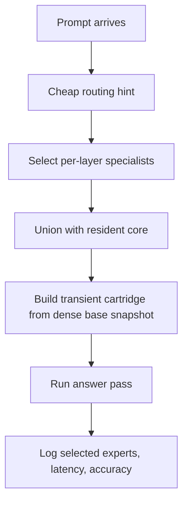

# Core + Specialist Dynamic Assembly

## Thesis

The right next architecture is a merger of:

1. **Prompt-conditioned transient cartridges**
2. **Core + specialist assembly**

That means:

- keep a small **always-resident core** of experts per layer
- add a small **prompt-conditioned specialist tail** per layer
- build the transient expert set from the immutable dense expert snapshot

This preserves shared competence while letting each prompt pull in missing specialists.

## Why this is better than static cartridges

Static benchmark-level cartridges are too coarse:

- one benchmark often needs more than one expert cluster
- some prompts need experts that were split across cartridges
- the current setup stores total capacity across cartridges, but does not make enough of it available in one forward pass

The merged design attacks that directly.

## High-level pipeline

## Runtime contract

### Always-resident core

For each MoE layer:

- choose a small core set of experts that stays available for every prompt
- this should capture broad/shared capability

Likely sources:

- global expert frequency
- REAP combined mass across observer suites
- cross-benchmark stability

### Prompt-conditioned specialist tail

For each prompt:

- score candidate experts or expert groups
- select a small tail per layer
- union with the resident core

The transient active expert set becomes:

`active_experts(layer) = core_experts(layer) ∪ specialists(prompt, layer)`

## First-pass scoring options

### Option A — observer prior only

Use:

- REAP summary scores
- task-family priors
- benchmark-conditioned historical winners

Fastest, but weakest.

### Option B — prompt-conditioned hint

Use a cheap first pass:

- short prompt embedding
- shallow router hint
- small-token probe

Better than benchmark-level selection.

### Option C — token/phase refresh

Use:

- initial transient set for first tokens
- optional refresh after early decode steps

Most powerful, but more complex.

## Recommended v1

Build **Option B** first:

- static core
- prompt-conditioned specialist tail
- one transient assembly per prompt
- no mid-generation refresh yet

## Runtime milestone reached

The multiplex server should not rebuild the full expert stack on every active-set change.

Current implementation direction:

- keep the dense expert snapshot immutable on CPU
- track the **current keep set** per layer on each worker
- on the next request, compute `added`, `removed`, and `reused` experts
- **zero only removed experts**
- **copy back only added experts**
- treat exact-signature repeats as no-op reuse

This gives expert-granularity delta swaps before introducing more advanced slot remapping.

## Assembly model

The server already has the crucial primitive:

- immutable dense base expert snapshot

So transient assembly should:

1. start from the dense expert snapshot
2. zero all non-selected experts
3. load only the selected union for the prompt
4. optionally apply router masks to the selected set

This avoids cumulative corruption and keeps the runtime deterministic.

## Data model

### Offline artifact

Store:

- `core_experts[layer]`
- expert frequency / mass tables
- optional expert clusters or cartridge unions

### Online selection payload

For each prompt:

- prompt id
- selected specialists per layer
- final active set per layer
- estimated bytes
- selection rationale

## Budgeting

At strict `20%` total resident BF16 on Qwen/Qwen1.5-MoE-A2.7B-Chat:

- always-resident trunk is already large
- remaining active expert budget is very small

So the core/tail split must be tight.

Conceptually:

- `core`: 1–2 experts/layer
- `tail`: 2–4 experts/layer

Exact values should come from the size estimator, not guesswork.

## Why this should help

This architecture fixes the main representational failure:

- static cartridges force unrelated prompts into one expert pack
- dynamic tail lets each prompt recover experts that were split apart
- resident core preserves shared competence

## Implementation phases

### Phase 1 — core selection

Add offline logic to compute:

- global core experts per layer

### Phase 2 — prompt-conditioned specialist scorer

Add a lightweight online scoring module that maps prompt -> top specialist candidates.

### Phase 3 — transient assembly

Replace benchmark-level cartridge selection with prompt-level dynamic assembly.

### Phase 4 — evaluation

Compare:

- static cartridge
- pairwise union
- core + dynamic tail

using the same harness.

## Success criteria

The architecture is working if:

- parse error rate drops materially from current static runs
- retained accuracy improves at the same resident-size target
- per-benchmark cliffs shrink
- selected expert sets vary meaningfully by prompt
