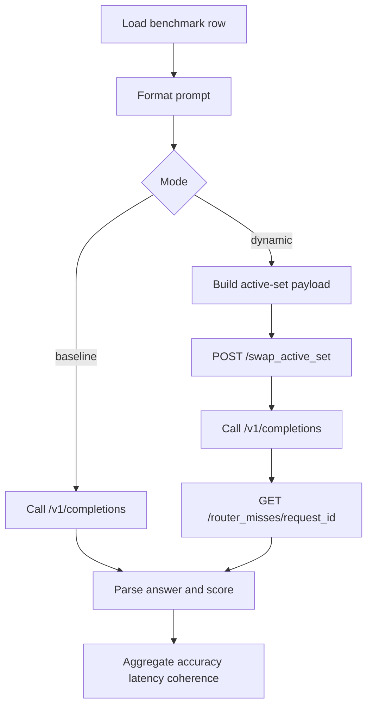

# REAP Expert-Swap System Technical Report

**Date:** March 12, 2026  
**Repo:** `reap-expert-swap`  
**Model under test:** `Qwen3.5-35B-A3B`  
**Experiment rule:** **all evaluator requests use `temperature: 0`** for both baseline and experimental runs.

---

## 1. Purpose

This document explains:

1. what system has been built in this repo,
2. how the runtime and evaluation loop work,
3. what changed during the current research cycle,
4. how quality loss is measured,
5. what tests exist today,
6. and what is still broken.

The project goal is not generic quantization or model distillation.
The goal is to serve the **original sparse model weights** with much less resident VRAM by keeping a resident expert floor and dynamically materializing the rest at runtime.

---

## 2. Problem statement

Large sparse Mixture-of-Experts models have two different sizes:

- **stored capacity**: all weights that exist,
- **available capacity**: the subset of experts actually present in VRAM when the router needs them.

This repo explores whether we can keep **all original experts reachable** while only keeping a much smaller fraction resident in BF16 VRAM.

The target shape is:

- preserve the original model’s practical behavior,
- keep resident VRAM dramatically below full BF16,
- and avoid catastrophic latency inflation.

For this repo’s current milestone, the practical question became:

> Can we make a resident floor plus dynamic expert swaps behave like the original Qwen3.5-35B-A3B runtime closely enough to be useful?

---

## 3. System overview

The system has four major layers:

1. **Plan construction**  
   Build a resident-core + specialist-slice plan offline.
2. **Dynamic serving runtime**  
   A patched vLLM-based multiplex server that can swap expert sets at request time.
3. **Evaluation harness**  
   Runs baseline and experimental requests on identical benchmark samples, compares quality, latency, and routing misses.
4. **Profiling / analysis tools**  
   Measure expert activity, attribute misses, build improved floors, and train lightweight support routers.

### Major code entry points

- Evaluator: `scripts/evaluate_original_vs_multiplex.py`
- Smoke runner: `scripts/run_autoresearch_dynamic_smoke.py`
- Dynamic active-set planner: `scripts/dynamic_reap.py`
- Runtime server: `scripts/vllm_multiplex_server.py`
- Router activity profiler: `scripts/profile_router_activity.py`
- Profile-derived floor builder: `scripts/build_profiled_floor_plan.py`
- Learned support-router tooling: `scripts/support_router.py`, `scripts/build_support_router_dataset.py`, `scripts/train_support_router.py`

---

## 4. Core runtime design

### 4.1 Baseline runtime

The baseline runtime serves the original model normally. It is the closest operational reference we have for “what the model should do” on the same hardware.

In practice the baseline server is run separately from the dynamic server.
Typical local endpoints used in this cycle:

- baseline: `:8010`
- dynamic: `:8011`

### 4.2 Dynamic runtime

The dynamic runtime does **not** keep all experts resident.
Instead it serves requests in three conceptual pieces:

- always-resident non-expert trunk,
- per-layer resident expert core,
- per-request specialist tail.

The active set for a request is:

```text
active_experts(layer) = core_experts(layer) ∪ selected_specialist_slices(layer)
```

### 4.3 Why the runtime had to change

The original swap path was too blunt. Rebuilding too much expert state on every change destroyed the economics of low-resident serving.

The runtime was patched so the server can perform **expert-granularity delta swaps**:

- copy only newly needed experts,
- zero only experts leaving the active set,
- reuse exact-signature repeats as no-ops.

That logic is visible in `scripts/vllm_multiplex_server.py` under `/swap_active_set`.

### 4.4 Active-set contract

The runtime requires a validated payload that includes:

- `request_id`
- `phase` (`prefill` or `decode_refresh`)
- `active_set`
- `selected_slice_ids`
- `budget_bytes`
- `active_set_signature`

`validate_active_set_payload(...)` in `scripts/dynamic_reap.py` enforces:

- all core experts remain present,
- active experts equal `core ∪ selected slices`,
- total active bytes stay inside the plan’s swappable budget.

This is a real correctness guard, not just logging.

---

## 5. Request lifecycle

### 5.1 Single-turn path



### 5.2 Multi-turn path

```mermaid
flowchart TD
    A[Load benchmark row] --> B[Build 3-turn protocol chain]
    B --> C{Dynamic?}
    C -->|yes| D[Conversation-aware active-set build]
    D --> E[Swap before turn]
    E --> F[/v1/chat/completions]
    C -->|no| F
    F --> G[Append assistant message]
    G --> H{More turns?}
    H -->|yes| C
    H -->|no| I[Score turn1 turn2 turn3 and conversation success]
```

The multi-turn evaluator uses `/v1/chat/completions` when available and can fall back to a serialized prompt transcript if needed.

---

## 6. Evaluation methodology

## 6.1 Benchmarks

The harness uses 5 benchmark families:

- `mmlu`
- `arc_challenge`
- `hellaswag`
- `winogrande`
- `gsm8k`

Dataset loading is deterministic per seed via `load_examples(...)` in `scripts/evaluate_original_vs_multiplex.py`.
The benchmark rows are shuffled with the same seed before sampling.

## 6.2 Determinism

All evaluation requests use **temperature 0**.

This is implemented in both request paths:

- `/v1/completions` payload sets `"temperature": 0`
- `/v1/chat/completions` payload sets `"temperature": 0`

This matters because the system is measuring runtime/policy differences, not sampling noise.

## 6.3 What is treated as truth

There are **two different truths** in this system:

### A. Benchmark truth

For benchmark correctness, the truth is the dataset label:

- MCQ: exact option token
- GSM8K: parsed numeric answer

This is the true correctness signal.

### B. Baseline truth

For **fidelity / regression measurement**, the baseline runtime is the operational target.
We compare the experimental system against the baseline run on the **same sampled prompts**.

So when we say “retained accuracy” or “retained coherence,” we mean:

> how much of the baseline’s aggregate performance the experimental system kept on the identical evaluation slice.

This is not identical to benchmark correctness. It is a regression metric.

## 6.4 Prompt matching requirement

Yes: the evaluator is designed so baseline and experimental runs use the **same prompts** when retained metrics are reported.

`compare_to_baseline(...)` only treats retained metrics as valid if baseline and candidate match on:

- protocol name/version/hash
- sample count per benchmark
- calibration count per benchmark
- seed
- per-result signature (`sample_id`, `benchmark`, `turn_index`, `final_turn_for_sample`)

If those differ, retained metrics are marked invalid via:

```text
retained_metrics_status = invalid_unmatched_baseline
```

This is one of the most important integrity rules in the repo.

## 6.5 Primary metrics

### Quality

- `accuracy`
- `coherence_rate`
- `parse_error_rate`
- `error_rate`

### Baseline-relative quality

- `accuracy_retained_pct`
- `coherence_retained_pct`
- `quality_loss_pct`
- `worst_benchmark_accuracy_drop_abs`

### Runtime / systems

- `avg_sample_time_s`
- `p95_sample_time_s`
- `avg_swap_time_s`
- `swap_count`
- `active_expert_bytes`
- `active_expert_count`

### Routing / support quality

- `avg_router_miss_inactive_ratio`
- inactive mass summaries
- selected slice IDs
- refresh suggested rate

### Multi-turn specific

- `turn1_accuracy`
- `turn3_accuracy`
- `answer_retention_rate`
- `turn2_coherence_rate`
- `conversation_success_rate`

---

## 7. Plan construction

## 7.1 Dynamic core/specialist plan

The main planning path lives in `scripts/dynamic_reap.py`.

It ranks candidate slices per layer and assembles a payload constrained by the plan budget. Newer versions also accept conversation context:

- `conversation_id`
- `turn_index`
- `messages`
- `conversation_context`

This lets multi-turn routing be aware of the whole conversation rather than only the last user turn.

## 7.2 Profile-derived floors

A major recent change was the addition of a **profile-derived floor** path.

Workflow:

1. run a stronger floor that preserves behavior better,
2. collect router activity and miss attribution,
3. summarize which experts are truly load-bearing,
4. build a smaller exact floor by combining active and inactive coverage envelopes.

Relevant tools:

- `scripts/profile_router_activity.py`
- `scripts/build_profiled_floor_plan.py`

This produced the first credible bridge down from the 50% regime.

## 7.3 Learned support router

A lightweight learned support-router path was also added.

Purpose:
- train a cheap prompt-conditioned reranker for slice selection,
- compare it to the existing heuristic priors,
- eventually use it to rerank marginal specialist slots.

Relevant tools:

- `scripts/support_router.py`
- `scripts/build_support_router_dataset.py`
- `scripts/train_support_router.py`

Current stance:
- useful offline signal,
- not yet trusted as the primary live allocator.

---

## 8. What changed in this research cycle

This repo changed in several important ways.

## 8.1 Runtime changes

### Delta swaps

The runtime now supports expert-level delta swaps instead of broad active-set rebuilds.
That means:

- repeated same-signature requests are cheap no-ops,
- sparse-to-sparse transitions only touch changed experts,
- swap telemetry includes bytes copied, zeroed, touched, and added/removed/reused expert counts.

### Request-state tracking

The dynamic server now tracks:

- request IDs,
- active signatures,
- refresh budget use,
- selected slice IDs,
- plan identity.

### Router activity capture

The runtime and analysis layer were extended so active expert usage can be profiled, not just misses.

## 8.2 Evaluator changes

### Multi-turn support

The evaluator was extended from single-turn completions to a real 3-turn chain protocol.

Added capabilities:

- `--protocol single_turn|multi_turn`
- `/v1/chat/completions` support
- per-turn rows
- conversation aggregates
- strict matched-baseline validation

### Protocol variants and replay rescoring

The evaluator now supports replay rescoring with alternate protocol variants.
This made it possible to isolate protocol loss from actual model/runtime loss.

Recent finding from replay calibration:

- original multi-turn protocol was overly lossy,
- `calib_reason_anchor_v2` materially improves parse reliability and turn-3 recommit scoring.

## 8.3 Selector changes

### Conversation-aware active-set selection

`build_active_set_payload(...)` now accepts conversation metadata so the routing payload can incorporate the full chat state.

### Support-router tooling

The repo can now:

- build a training dataset from dynamic artifacts,
- derive slice-space labels,
- train a prompt-only reranker,
- evaluate it against heuristic coverage.

## 8.4 Profiling and contamination control

The analysis path now includes:

- router activity summaries,
- profile-derived floor construction,
- contamination audits,
- holdout reruns.

This matters because earlier “breakthrough” style results needed a contamination check when profile source prompts overlapped with evaluation prompts.

## 8.5 File-level change map

Key file-level changes in the current system:

- `scripts/vllm_multiplex_server.py`
  - added dynamic `/swap_active_set` path with delta swap accounting, request-state tracking, signature reuse, and plan identity reporting
- `scripts/dynamic_reap.py`
  - hardened active-set payload validation and added conversation-aware payload inputs
- `scripts/evaluate_original_vs_multiplex.py`
  - added multi-turn evaluation, chat-completions transport, replay rescoring, baseline-match validation, and conversation summaries
- `scripts/run_autoresearch_dynamic_smoke.py`
  - passes through protocol settings and captures retained-metric outputs in smoke artifacts
- `scripts/profile_router_activity.py`
  - summarizes active/inactive expert usage and per-layer miss structure from dynamic artifacts
- `scripts/build_profiled_floor_plan.py`
  - builds smaller exact floors from measured activity envelopes
- `scripts/support_router.py`
  - derives dataset rows and slice-space targets for the learned support-router path
- `tests_py/test_multiturn_evaluator.py`
  - verifies multi-turn protocol logic and baseline-match invalidation behavior
- `tests_py/test_router_activity.py`
  - verifies router activity aggregation math
- `tests_py/test_profiled_floor_plan.py`
  - verifies profile-derived floor construction and budget recomputation
- `tests_py/test_support_router.py`
  - verifies dataset extraction and plan resolution for learned routing

---

## 9. Current empirical picture

## 9.1 Runtime path

The runtime path is no longer the main mystery.
Delta swaps work and profile-derived floors can preserve meaningful behavior at much lower resident size than the naive exact 50% floor.

## 9.2 Multi-turn protocol loss

One of the biggest recent findings is that the **protocol itself** was inducing major loss.

On the tiny matched set:

- original multi-turn baseline: very lossy,
- calibrated replay multi-turn baseline: much better,
- calibrated replay dynamic: also better, but still behind baseline.

That means protocol quality and parse/recommit design were contaminating the measurement.

## 9.3 Core undercoverage

The activation-diff analysis shows that the current profiled floor still under-covers the full-model activity envelope.

From `test-output/activation-diff-20260312/activation-diff-analysis.json`:

- resident experts: `3425`
- full-model 95% activity envelope: `6024`
- overlap with resident core: `2417`
- overlap ratio: `40.12%`
- missing from core: `3607`
- inactive mass landing on full95 experts: `58.79%`

Interpretation:

- behavior can still look good on small matched control slices,
- but structurally the floor is missing too many experts the full model really uses,
- especially in a handful of layers.

Top problematic layers right now:

- `layer_1`
- `layer_3`
- `layer_2`
- `layer_34`
- `layer_33`

---

## 10. Tests and validation

## 10.1 Automated tests

Current targeted validation run:

```bash
PYTHONDONTWRITEBYTECODE=1 uv run python -m unittest \
  tests_py.test_dynamic_reap \
  tests_py.test_multiturn_evaluator \
  tests_py.test_router_activity \
  tests_py.test_profiled_floor_plan \
  tests_py.test_support_router \
  tests_py.test_runtime_contract_hardening
```

Result:

- **87 tests passed**
- **3 skipped**

Compile validation:

```bash
PYTHONDONTWRITEBYTECODE=1 uv run python -m py_compile \
  scripts/evaluate_original_vs_multiplex.py \
  scripts/run_autoresearch_dynamic_smoke.py \
  scripts/dynamic_reap.py \
  scripts/vllm_multiplex_server.py \
  scripts/profile_router_activity.py \
  scripts/build_profiled_floor_plan.py \
  scripts/support_router.py
```

Result:

- **passed**

Saved report:

- `test-output/technical-doc-20260312/test-report-20260312.md`

## 10.2 What those tests cover

### `tests_py/test_dynamic_reap.py`
Covers:

- active-set payload formation
- budget enforcement
- core preservation
- slice selection behavior
- conversation-aware payload changes

### `tests_py/test_multiturn_evaluator.py`
Covers:

- multi-turn protocol handling
- replay rescoring
- baseline-match invalidation
- conversation-aware payload plumbing

### `tests_py/test_router_activity.py`
Covers:

- router activity summarization
- per-layer coverage calculations
- prompt/layer profile construction

### `tests_py/test_profiled_floor_plan.py`
Covers:

- profile-derived floor replacement logic
- budget recomputation
- resident ratio recalculation

### `tests_py/test_support_router.py`
Covers:

- dataset row extraction
- plan resolution from dynamic artifacts
- slice target derivation

### `tests_py/test_runtime_contract_hardening.py`
Covers:

- runtime identity / checkpoint evidence rules
- active-set payload expectations
- contract-level hardening invariants

## 10.3 Experiment artifacts as proof surface

This repo also relies heavily on run artifacts, not just unit tests.

Important proof directories include:

- `test-output/qwen35-delta-swap-remote-20260310/`
- `test-output/qwen35-floor-frontier-20260310/`
- `test-output/qwen35-floor-profile-20260311/`
- `test-output/multi-turn-eval-20260311/`
- `test-output/multi-turn-eval-20260312/`
- `test-output/activation-diff-20260312/`
- `test-output/support-router-v0/`

This is intentional: the system is partly a research runtime, so evidence must be inspectable after the fact.

---

## 11. Known issues

1. **Gate evidence linkage still has a known invalidation path**  
   Some dynamic artifacts still fail strict acceptance because `swap_plan_identity plan_path does not match plan identity`.

2. **Multi-turn evaluation still needs live calibrated reruns**  
   Replay calibration proved the protocol was too lossy, but replay is not the same thing as a fresh live rerun.

3. **Profiled floor is still under-covering the true core**  
   Activation diff shows too much important expert mass still lands outside the resident floor.

4. **Learned support-router is not yet the main allocator**  
   It has useful offline signal, but it is not yet trusted to own the live selection policy.

5. **Tiny matched control sets can overstate stability**  
   They are useful for isolation, but not enough for a final quality claim.

---

## 12. Recommended next work

1. **Promote calibrated multi-turn protocol into live runs**  
   Stop using the lossy default protocol for serious comparison.

2. **Patch the resident floor in the top mistake layers**  
   Start with `layer_1`, `layer_3`, `layer_2`, `layer_34`, `layer_33`.

3. **Rerun matched baseline + dynamic on larger seed sweeps**  
   Especially multi-turn with pass-5 distinct seeds.

4. **Use the learned router as a marginal-slot reranker**  
   Do not hand it the whole plan yet.

5. **Keep contamination audits mandatory**  
   Profile-derived wins need clean holdout confirmation.

---

## 13. Bottom line

This system is no longer a toy static-pruning experiment.
It is now a real dynamic serving stack with:

- plan construction,
- runtime expert swaps,
- benchmark evaluation,
- multi-turn protocol support,
- router activity profiling,
- profile-derived floor construction,
- and a first learned support-router path.

The key result so far is not “we solved 5%.”
The key result is:

> the runtime path is now real enough that the remaining bottlenecks are measurable.

Those bottlenecks are currently:

- protocol loss in multi-turn eval,
- and more importantly,
- under-coverage of the true expert core.

That is where the next work should go.
